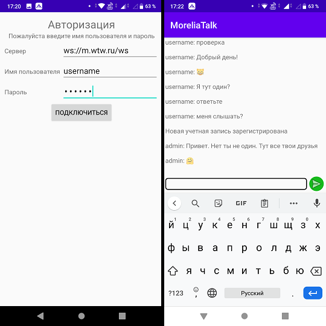

# MoreliaTalk Client - мессенджер (клиент) на платформе Android #

## В репозитории 2 бранча ##

[master](https://github.com/MoreliaTalk/morelia_client_android_java/tree/master) - Основная и стабильная ветка.

[develop](https://github.com/MoreliaTalk/morelia_client_android_java/tree/develop) - Ветка для добавления нового функционала.

## В разработке применяется ##

[Android Studio 4](https://developer.android.com/studio) - интегрированная среда разработки на языке Java

[Java WebSockets](https://github.com/TooTallNate/Java-WebSocket) - библиотека реализующая функционал клиента WebSocket

[Gson](https://github.com/google/gson) - библиотека реализующая функционал работы json объектами

## Установка готового приложения на устройство Android ##

Необходимо разрешить приложения из неподписанных источников в настройках.

Настройки - Приложения - Неизвестные источники

Скачать последнюю версию [релиза](https://github.com/MoreliaTalk/morelia_client_android_java/releases) с Github и установить

## Установка проекта ##

Установить [Android Studio](https://developer.android.com/studio) версии 4 и выше.

Загрузить и установить последнюю версию [git](https://git-scm.com/downloads).

При запуске Android Studio выбрать пункт "Get from version control", выбрать Github введя свой логин и пароль и клонировать на свой компьютер репозиторий MoreliaTalk/morelia_client_android_java

## Форк репозитория ##

Если ты не включен в команду на GitHub'е проекта, то тебе необходимо сначала форкнуть к себе репозиторий MoreliaTalk Client перейдя по [ссылке](https://github.com/MoreliaTalk/morelia_client_android_java/fork).

## Создание пулл-реквеста для внесенния изменений в develop-ветку MoreliaTalk Client ##

Для создания пулл-реквеста, необходимо перейти на [GitHub](https://www.github.com), выбрать свой форк и в правом меню нажать на `New pull request`, после чего выбрать бранч из которого будет производится перенос изменений в develop-ветку MoreliaTalk Client и нажать `Create pull request`.

Пулл-реквесты напрямую в ветку master не допустимы, даже при очевидности внесенных изменений. 

## Требования к стилю кода ##

Перед началом работы рекомендуется прочитать [Google Java Style Guide](https://google.github.io/styleguide/javaguide.html). Обязательно использовать встроенный линтер Android Studio (пункт меню Analyze - Inspect code...).

## Контакты ##

[Telegram](https://t.me/joinchat/LImHShzAmIWvpMxDTr5Vxw) - группа где обсуждаются насущные вопросы.

[Trello](https://trello.com/b/qXjJFTP3/develop) - kanban-доска для проекта.

## Ссылки ##

Изначально проект разрабатывался в личном репозитории https://github.com/rus-ai/MoreliaTalkClient_Android_Java но в дальнейшем перенесен в общий проект. Дальнейшая разработка будет вестись здесь.
